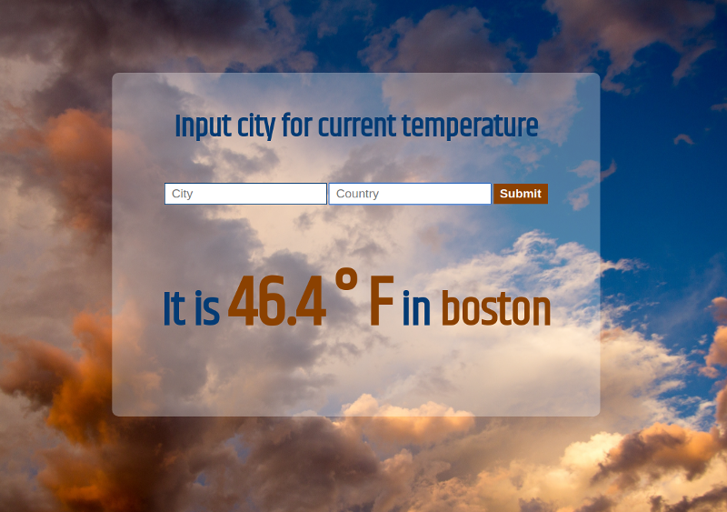

# Weather API
Enable your user to enter a city + country and return the temperature in Fahrenheit

**Link to project:** https://eager-villani-263b8c.netlify.com

## How It's Made:

**Tech used:** HTML5, CSS3, JavaScript, openweathermap's API
Styling for this project was done using CSS Grid & Flexbox. Written in vanilla Javascript using the fetch method to access Open Weather Map's API.

## Lessons Learned:
Used HTML5's date input to retrieve a date from the user and then used string templating to change the date in openweathermap's API link query parameter to the date given by the user.

## Examples:

**OOP Calculator:** https://github.com/ericamendez/week01-alumni-project-calculator

**Simple NASA API** https://github.com/ericamendez/simple-nasa-api-bootcamp2018c-week07

**Daily Code Challenges:** https://github.com/Eriquette/Daily-Code-Challenges
